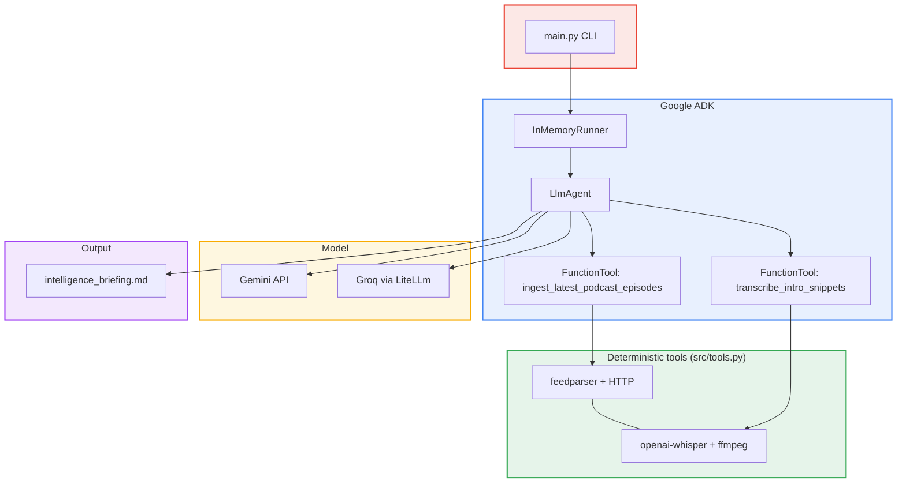
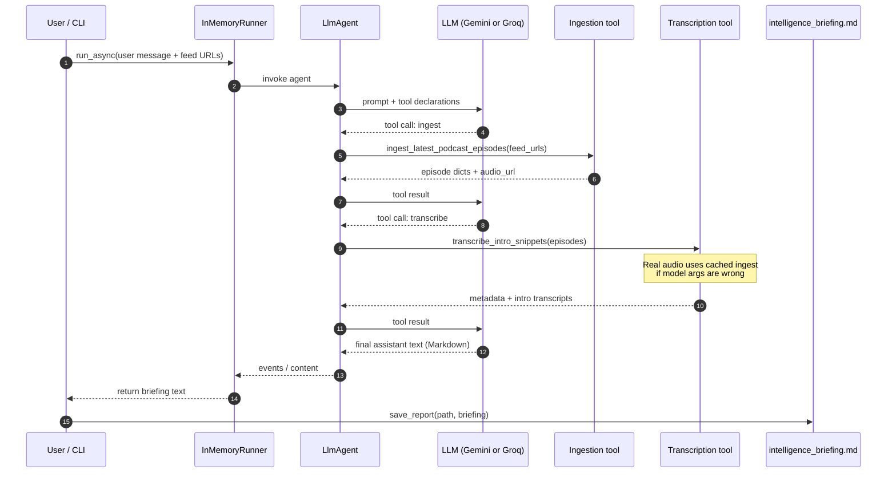
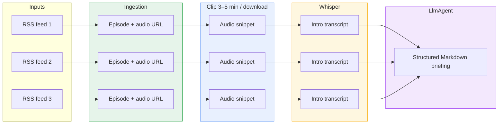

# Podcast Intelligence Agent

**Repo:** [shreyakhetan09/PodcastAgent](https://github.com/shreyakhetan09/PodcastAgent)

**Multi-source podcast briefing pipeline** built on **Google Agent Development Kit (ADK)** in Python. The agent orchestrates RSS ingestion and Whisper transcription via **FunctionTools**, then produces a structured **Markdown intelligence briefing** saved as `intelligence_briefing.md`.

[](https://www.python.org/downloads/)
[](https://github.com/google/adk-python)

---

## Table of contents

1. [Overview](#overview)
2. [Architecture](#architecture)
3. [ADK execution model](#adk-execution-model)
4. [End-to-end data flow](#end-to-end-data-flow)
5. [Features & assignment mapping](#features--assignment-mapping)
6. [Installation](#installation)
7. [Configuration](#configuration)
8. [Usage](#usage)
9. [Briefing output structure](#briefing-output-structure)
10. [Repository layout](#repository-layout)
11. [Troubleshooting](#troubleshooting)
12. [Further reading](#further-reading)

---

## Overview

| Layer | Responsibility |
| --- | --- |
| **Google ADK** | `InMemoryRunner` runs an `LlmAgent` that decides *when* to call tools and *how* to turn tool results into prose. |
| **FunctionTools** | Deterministic **ingestion** (RSS → latest episode + audio URL) and **transcription** (short audio clip → Whisper text). |
| **LLM backend** | **Gemini** (native ADK) or **Groq** via **`LiteLlm`** — free-tier friendly. |
| **Output** | Single file: **`intelligence_briefing.md`** (UTF-8). |

Secrets stay in **`.env`** (ignored by git). Use **`.env.example`** as the template.

---

## Architecture

High-level view: **CLI → ADK runner → tools → LLM → Markdown file**.



---

## ADK execution model

The **agent** receives system instructions (`src/prompts.py`) and a user message listing **three RSS URLs**. ADK’s runtime **binds** the two Python callables as tools, sends their **schemas** to the model, and **executes** tool calls when the model requests them. Results are fed back until the model emits the final Markdown.



---

## End-to-end data flow

What moves through the pipeline (three podcasts in parallel where applicable).



---

## Features & assignment mapping

| Requirement | Where it lives |
| --- | --- |
| **`google-adk`** | `LlmAgent`, `InMemoryRunner`, `FunctionTool` in `src/agent_pipeline.py` |
| **Ingestion (3 RSS → latest episode + audio URL)** | `ingest_latest_podcast_episodes` → `src/tools.py::ingest_latest_episodes` |
| **Transcription (3–5 min clip, Whisper tiny/base)** | `transcribe_intro_snippets` → `transcribe_all_parallel` / `transcribe_intro_clip` |
| **Agent instructions & briefing layout** | `src/prompts.py` (`ADK_SYSTEM_INSTRUCTION`): per-show tables, episode vs series, cross-pollination table + subsections, product implications |
| **Output file** | `intelligence_briefing.md` via `Settings.output_path` (`src/config.py`) |
| **$0 / free tier** | Groq + `USE_GROQ_ONLY=1`, or Gemini with `GEMINI_API_KEY` |
| **Scaling discussion (deliverable)** | `SCALING_NOTES.md` |

---

## Installation

**Python 3.10+** is recommended (ADK and asyncio behavior; avoids many 3.9 warnings).

```bash
cd "/path/to/Final Felix"
python3.10 -m venv .venv
source .venv/bin/activate   # Windows: .venv\Scripts\activate
pip install --upgrade pip
pip install -r requirements.txt
cp .env.example .env
# Edit .env with your keys (never commit .env)
```

**System notes**

- **ffmpeg**: Provided indirectly via **`imageio-ffmpeg`** for Whisper decoding.
- First Whisper run may **download model weights** (`tiny` by default).

---

## Configuration

Environment variables are loaded from **`.env`** at the project root (`src/config.py`).

| Variable | Purpose |
| --- | --- |
| **`USE_GROQ_ONLY`** | If set truthy (`1`, `true`, etc.), uses **Groq** through `LiteLlm`; **no** Gemini key required. |
| **`GROQ_API_KEY`** | Required when `USE_GROQ_ONLY` is enabled. |
| **`GEMINI_API_KEY`** | Required when **not** using Groq-only mode (`GOOGLE_API_KEY` / `GEMINI_API_KEY` are set for ADK). |
| **`GROQ_MODEL`** | Optional override (default e.g. `llama-3.3-70b-versatile`). |
| **`GEMINI_MODEL`** | Optional override (default `gemini-2.0-flash`). |

Whisper clip length is clamped to **3–5 minutes** in code; model name defaults to **`tiny`** in `Settings` (`src/config.py`).

---

## Usage

```bash
source .venv/bin/activate
python main.py
```

- **Output path** is printed; default **`intelligence_briefing.md`** in the project root.
- **Preview**: the first ~1200 characters of the briefing are echoed to the terminal.

**Debug env (no secrets printed)**

```bash
python main.py --debug-env
```

**Change feeds**

- Edit **`DEFAULT_FEEDS`** in `src/agent_pipeline.py`, or
- Call **`run_pipeline(settings, feed_urls=[...])`** from your own script with exactly **three** URLs.

---

## Briefing output structure

The model is instructed (`src/prompts.py`) to produce:

1. **Title** `# AI / ML / Learning — Podcast Intelligence Briefing` and a **scope blockquote**.
2. **Three numbered show sections** (`## 1. …` … `## 3. …`) with metadata table, episode vs series, two-line summary, two intro bullets, tone/audience, similar podcasts, and **`---`** between major show blocks.
3. **`## Cross-pollination (AI/ML/tech landscape)`** with a comparison table and subsections (**Common themes**, **Divergence**, **One surprising contrast**).
4. **`## Product and R&D implications`** (bullet list).

Evidence is **RSS + intro transcripts only**; broader claims should be marked **(inference)** where appropriate.

---

## Repository layout

```
Final Felix/
├── main.py                 # CLI entrypoint
├── requirements.txt
├── .env.example            # Template for secrets (no real keys)
├── .gitignore              # .env, .venv, bytecode, etc.
├── intelligence_briefing.md # Generated briefing (committed as sample / deliverable)
├── SCALING_NOTES.md        # Scale-out & rate-limit notes
├── README.md
└── src/
    ├── agent_pipeline.py   # ADK: LlmAgent, tools, asyncio.run, save
    ├── tools.py          # RSS, clip download, Whisper
    ├── prompts.py        # ADK_SYSTEM_INSTRUCTION, build_user_task
    ├── config.py         # Settings from environment
    ├── models.py         # Episode / EpisodeTranscript dataclasses
    └── report.py         # save_report()
```

---

## Implementation notes

| Topic | Behavior |
| --- | --- |
| **Intro clip duration** | Audio is **downloaded with a byte cap**, then **FFmpeg `-t`** decodes/trim to a **wall-clock** limit (3–5 minutes, from `Settings`). That avoids relying on a fixed bytes-per-second guess for **variable-bitrate** streams. If FFmpeg fails on a rare container, transcription falls back to the **raw downloaded prefix** (legacy behavior). |
| **Final briefing text** | ADK may emit several assistant text chunks (streaming, interim thoughts). The runner prefers the **last complete chunk** if it looks substantial; otherwise it falls back to the **longest** chunk. Unusual provider chunking can be tuned via `min_substantial_chars` in `_pick_final_briefing_text` (`src/agent_pipeline.py`). |

---

## Troubleshooting

| Symptom | Likely cause | What to try |
| --- | --- | --- |
| **Missing API key** | `.env` empty or wrong mode | Use `.env.example`; set Groq-only **or** Gemini per table above. |
| **Groq `tool_use_failed`** | Model emitted a malformed tool call | **Retry** the run; **ingest snapshot** still protects transcription audio URLs. |
| **SSL / “Event loop is closed” after success** (older Python) | Async HTTP cleanup vs closed loop | Prefer **Python 3.10+**; code calls **`close_litellm_async_clients`** after `runner.close()` to reduce this on Groq. |
| **Slow first run** | Whisper / PyTorch download | Normal; keep **`tiny`** model for speed. |
| **401 / auth** | Truncated key in `.env` | If the key contains `#`, wrap in **double quotes** in `.env`. |

---


*Documentation version aligned with the codebase in this repository. For questions about ADK behavior, refer to the official ADK docs and release notes.*
