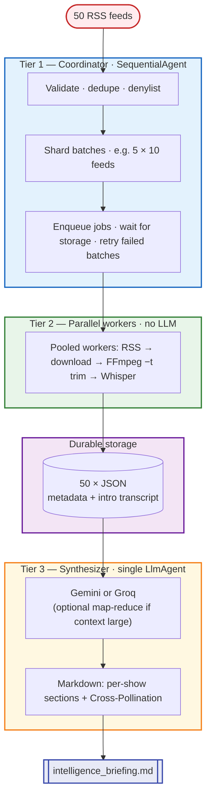

# Scaling to 50 concurrent podcasts

*Take-home answer:* If this ran every morning for **50 feeds**, how would you architect the **Google ADK** workflow, and how would you handle **transcription compute** and **LLM rate limits**?

---

## Why a flat single-agent design breaks

One **`LlmAgent`** driving ingest + transcribe across 50 feeds creates **serial I/O**, **long tool chains** (many round-trips), **context risk** if the model ever holds bulk transcript text, and **rate-limit burnout** when each feed implies extra API traffic. The fix is a **three-tier graph**: coordinator → **LLM-free workers** → **one synthesizer**.

---

## Three-tier ADK architecture

### Tier 1 — Coordinator (`SequentialAgent`)

- **Validate** all 50 URLs (format, denylist, dedupe).
- **Shard** into fixed batches (e.g. **5×10** feeds).
- **Enqueue** work and **gate** the synthesizer until **every** batch has written results to **durable storage** (object store or queue ACK).
- **Partial failures:** retry or re-queue **one batch** without blocking the others; synthesizer runs only when the manifest is complete or you’ve applied an explicit “best effort” policy.

`SequentialAgent` matches a morning job: *validate → shard → drain batches → synthesize once*.

### Tier 2 — Workers (parallel; **no LLM**)

- **Goal:** zero model calls here — **~49 fewer API request patterns** per run than “one agent per feed.”
- Each worker runs the **same deterministic chain** this repo encodes: **RSS → bounded download → FFmpeg `-t` trim (wall-clock 3–5 min) → Whisper**.
- **Concurrency:** use a **pool** (e.g. **10–20** workers for I/O-bound fetch; **5–8** for Whisper so CPU/RAM don’t saturate). Fifty *logical* tasks can be **multiplexed** across that pool — not 50 unbounded threads.
- **`ParallelAgent`** in ADK is for **parallel child agents**. Here, workers are often **pure Python + queues** (or thin ADK agents with **tools only** and no `generate`). Use `ParallelAgent` when you want first-class ADK observability across branches; the key design point is **no LLM at this tier**.

### Tier 3 — Synthesizer (single `LlmAgent`)

- **Input:** the **50 structured JSON** blobs from storage (metadata + intro transcripts).
- **Output:** one **Markdown** file (`intelligence_briefing.md`), including **per-show sections** and **Cross-Pollination**.
- **Backend:** same idea as this repo — **`gemini-2.0-flash`** or **`groq/...`** via **`LiteLlm`**, controlled by env (**`use_groq_only`**). That flag is a **deployment choice**, not automatic runtime failover unless you add a circuit-breaker.
- **Context:** fifty intros can be **tens of thousands of tokens** depending on length. If you approach **TPM or context caps**, use **map-reduce** (e.g. summarize batches of 10, then one final synthesis) — still **far fewer** LLM calls than per-feed agents.

---

## Transcription compute

| Mode | Approach |
| --- | --- |
| **Local / take-home** | **Serial** or a **small pool** (e.g. 5–10 parallel Whisper jobs on CPU); often **~15–25** minutes for 50 clips, order-of-magnitude. |
| **Production** | **GPU** workers (e.g. GCE **L4/T4**); **one clip per job**; FFmpeg trim already caps wall-clock duration and keeps GPU time predictable. |
| **Queue** | **Pub/Sub**, **Celery + Redis**, or **Cloud Run jobs**; **autoscale on queue depth**, not on raw feed count. |
| **Caching** | Key ≈ **`hash(feed_url, episode_guid, clip_seconds, whisper_model_version)`** in **GCS/S3**. On a daily job, **unchanged episodes** skip Whisper — savings scale with **repeat traffic** (quote **exact multipliers** only after measuring your hit rate). |

This repo’s **FFmpeg time trim + bounded download** is the right baseline for **VBR-safe** clips.

---

## LLM API rate limits

Official limits **change by model, project, and tier**. **Always** confirm live values: [Gemini rate limits](https://ai.google.dev/gemini-api/docs/rate-limits), [Groq rate limits](https://console.groq.com/docs/rate-limits).

**Planning anchors** (illustrative, not guarantees):

| Provider | Example tier knobs | Rough implication |
| --- | --- | --- |
| **Gemini** (free / dev) | **RPM**, **TPM**, **RPD** per model | **One** synthesizer call (with optional map-reduce) stays tractable; **fifty** per-feed LLM runs usually do not. |
| **Groq** (free / dev) | **~tens RPM** org-wide for many models; **TPM** model-specific | Keep **worker tier LLM-free**; **serialize** or **throttle** any extra agents. |

**Mitigations (design targets; not all are implemented in this repo):**

1. **Workers carry no LLM** — removes the dominant multi-request pattern at scale.
2. **Token bucket** (or semaphore) on **`(provider, key)`** before dispatching any model call.
3. **Retry with exponential backoff + jitter** on **`429` / `RESOURCE_EXHAUSTED`** — **add** around the synthesizer in production (this codebase does not wrap `_run_adk_agent` today).
4. **Storage-first** — workers **finish writes** before synthesis starts; the model never blocks on RSS/audio I/O.
5. **Provider selection** — **`use_groq_only`** / Gemini key is an **ops** switch; **automatic** cross-provider failover would be a separate small layer.

---

## Cost sketch (one morning, 50 feeds, free tier)

| Stage | What runs | $ |
| --- | --- | --- |
| RSS + HTTP | Parallel fetches | **0** |
| Download + FFmpeg | Bounded bytes + **`-t`** trim | **0** |
| Whisper | Open weights, your CPU/GPU | **0** |
| **One** (or few) LLM synthesis | Within free-tier quotas | **0** |
| **Total** (assignment-style stack) | | **~0** |

---

## Architecture diagram

On **GitHub**, the diagram below renders with **colored tiers** (Mermaid). In plain text viewers you still have the section headers above.

---

*This document merges a production-style 50-feed ADK layout with conservative claims: quota numbers and speedups must be validated against your provider account and measured cache behavior.*
